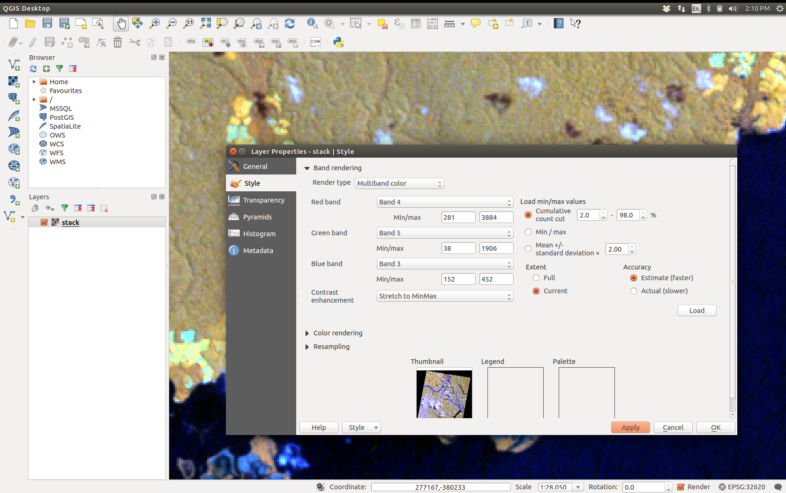
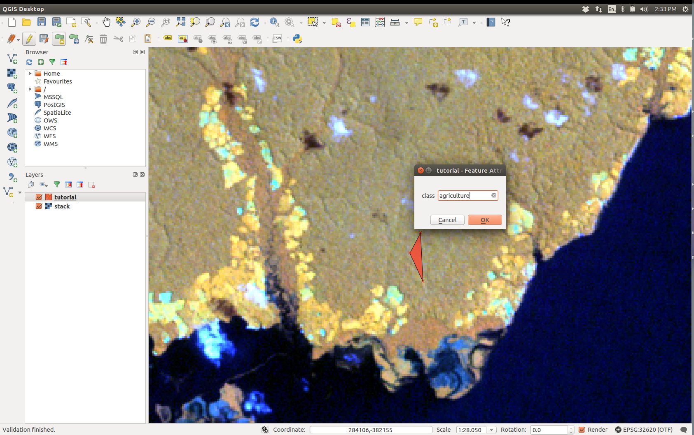

# Make a quick land-cover map, using QGIS and R, *Example with Landsat Data*

## Download data

## Unpack the archive

```sh
tar -zxvf archiveName.tar.gz
```

### Create a multilayer object

Use `gdal_merge.py` either throuh the command line (using the `-separate` switch), or via QGIS (Raster > Misc > Merge ...)

### Load multi-layer object into QGIS

- Select your favourite band combination (4, 5, 3 on Landsat 5 and 7 works well for me)
- Make sure you have a good (colour) stretch (in Layer properties, select Extent: **current**, click on **Load** and **Apply**. Adjust if required by refocusing the area or playing with the way min/max is defined).



### Create a new Vector Layer

In QGIS there is a button *Create a new vector layer*, on the left tool bar.

- Select *Polygon*
- Add a new attribute named *class*, keep the type to *text data*
- Remove the ID attribute
- Click OK
- Chose a file name and save the layer

### Add training polygons

- right click on the polygon layer
- enable editing *toggle editing*
- Click on the add feature icon (editing toolbar on top)
- Left click to select the vertices of the polygon, then right click anywhere to finish the drawing of the polygon
- When prompted for *class*, write the land cover of the polygon you just drawn (e.g. `urban`, `water`, `agriculture`, etc) (if you have several polygons for the same class, make sure you strictly spell them in the same way).
- When you have enough polygons, untoggle editing



### Train a classifier and produces the map

This step is done in R, you need to have `dplyr`, `raster`, `sp`, `rgdal` and `randomForest` installed. Then run the code below and you'll have your land cover map.

```r
library(raster)
library(randomForest)
library(dplyr)

# Variables
shapePath <- 'path/to/shapefile.shp'
brickPath <- 'path/to/multilayerObject.tif'
lcPath <- 'path/to/lcMap.tif'

# Load objects
spdf <- shapefile(shapePath)
brick <- brick(brickPath)

# Get the vector of polygon class
classes <- spdf$class

# Extract training data from the brick
trainingDf <- extract(brick, spdf, df = TRUE) %>%
  mutate(class = classes[ID]) %>%
  dplyr::select(-ID) %>%
  mutate(class = as.factor(class))

# Train the classifier
rf <- randomForest(formula = class ~ ., data = trainingDf)

# Predict lc raster and write to file (eventually)
lc <- predict(brick, rf)
writeRaster(lc, lcPath, datatype = 'INT1U')
```